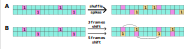

# Triples in dynamic networks  

An algorithm searching for triple patterns in dynamic networks.  

## Pipeline

### 1. Graph Randomization  
This module generates random graphs based on calcium activity data. Here we consider 2 methods based on a randomized sequence of calcium events obtained from experimental data:  
1) shuffling spikes  
2) dynamic shift of spikes   

  

 Example of code is listed in [`1_graph_randomization.ipynb`](notebooks/1_graph_randomization.ipynb)  
### 2. Triple Calculation  
This module performs triple search on a graph and retrieves information associated with behavioral markup.  
Here, we consider only patterns for which exactly two edges in the triple were active while the third was absent [[1]](#1).  

 

Here are examples of found triples in biological data.

  

Example of code is listed in [`2_triple_calc.ipynb`](notebooks/2_triple_calc.ipynb)  
### 3. Chi-square Calculation  
This module performs a statistical evaluation of the significance of triple activity in relation to behavioral markup.  
Example of code is listed in [`3_chi2_calc.ipynb`](notebooks/3_chi2_calc.ipynb)  

## Installation 
You can install the library from source using Poetry. Run the following command in the root directory of the project:  
`poetry install`

## Dependencies  
- [Pandas](https://github.com/pandas-dev/pandas)  
- [Numpy](https://numpy.org/)  
- [Scipy](https://scipy.org/)  
- [Numba](https://numba.pydata.org)  
- [Statsmodels](https://www.statsmodels.org/)

## Authors
* **Alena Varekhina**  - *Implementation* - [alvareum](https://github.com/alvareum)
* **Alexandr Pakhomov** - *Review* - [TVK-dev](https://github.com/TVK-dev)
* **Vladimir Sotskov** - *Project vision*
* **Konstantin Anokhin** - *Project vision*
* **Mikhail Krivonosov** - *Project vision* - [mike_live](https://github.com/mike-live)
* **Mikhail Ivanchenko** - *Project vision*

## References

<a id="1">[1]</a> 
Varekhina A.V., Ivanchenko M.V., Sotskov V.P, Krivonosov M.I., Anokhin K.V. 
Identification and analysis of active neural cell ensembles associated with mice behavioral patterns. 
In: Proceedings of the 14th BGRS/SB, 2024; Novosibirsk. August 5-10 2024. P. 1854 – 1856. 
https://doi.org/10.18699/bgrs2024-10-02
